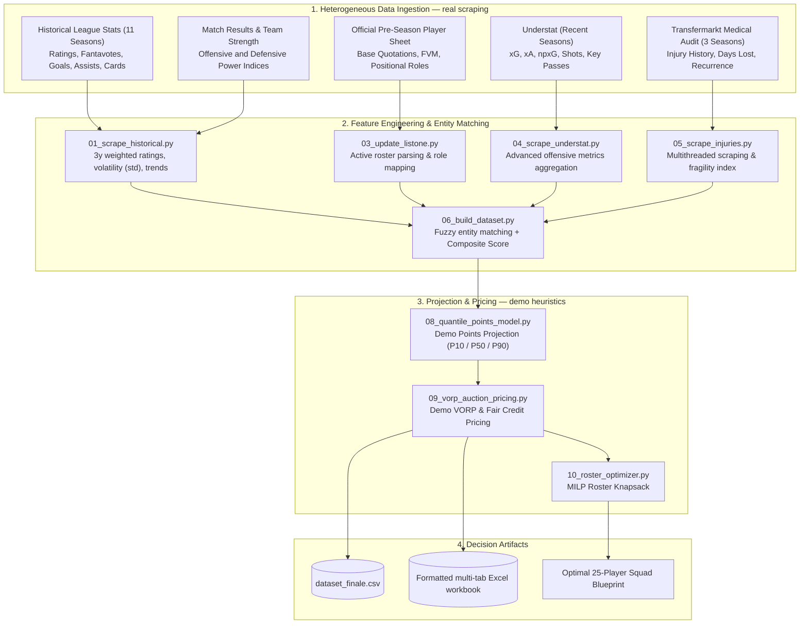
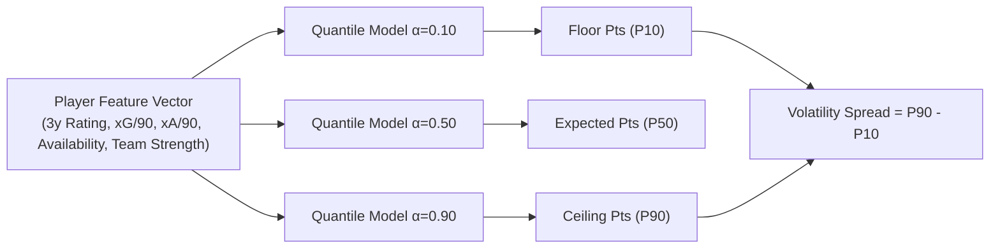
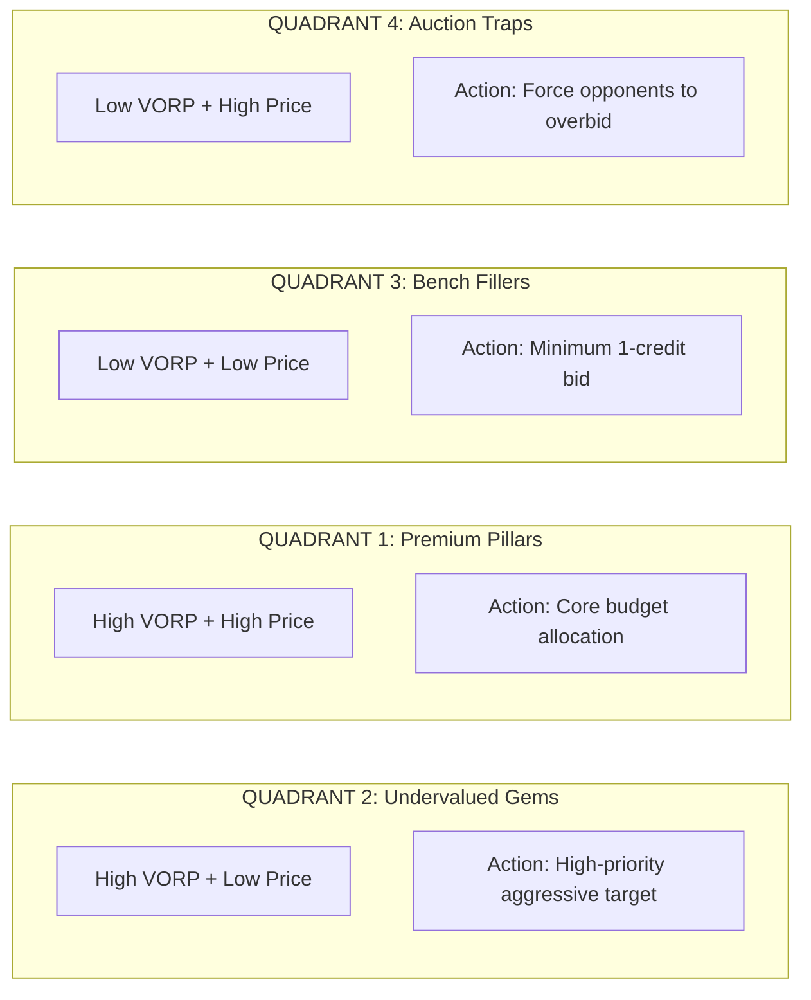

# Spectre - FantaMoneyball — Quantitative Fantasy Football & League Analytics Framework

[](https://www.python.org/)
[](LICENSE)
[](https://docs.scipy.org/doc/scipy/reference/generated/scipy.optimize.milp.html)
[-yellow.svg)](docs/MODEL_INTERPRETABILITY.md)
[](https://buymeacoffee.com/blueskies360)

A modular, data-driven pipeline for data extraction, probabilistic points projection,
sabermetric valuation (VORP), and mathematical roster optimization for fantasy football
auctions (Fantacalcio Serie A).

📖 **Model Interpretability & Math Guide**: [docs/MODEL_INTERPRETABILITY.md](docs/MODEL_INTERPRETABILITY.md)
📐 **Composite Scoring Methodology**: [docs/scoring_methodology.md](docs/scoring_methodology.md)
🗺️ **Pipeline Architecture**: [docs/pipeline_architecture.md](docs/pipeline_architecture.md)

## Demo positioning

**This is a public demonstration build, not the production system.** The ingestion layer
(`01_scrape_historical.py`, `04_scrape_understat.py`, `04b_scrape_lineups.py`,
`05_scrape_injuries.py`) genuinely scrapes fantacalcio.it, football-data.co.uk, Understat and
Transfermarkt — it hits real endpoints and produces real historical and injury datasets.
The points projection and pricing formulas shown below (`08_quantile_points_model.py`,
`09_vorp_auction_pricing.py`) are demonstrative, calibrated to teach the methodology, not to
win your league. The production version — real quantile regression models trained on 11+
seasons, refined VORP pricing, a post-draft audit engine, a trade analyzer, a lineup
optimizer, and an AI draft copilot — is a private commercial product and is **not**
distributed in this repository. No live demo link is provided on purpose: clone it, run it
locally, and judge the methodology on its own terms.

---

## The Problem: Why Intuition Systematically Fails at Auctions

Every pre-season, millions of fantasy managers sit around the draft table convinced that
their "gut feeling" will secure the championship. The empirical results are embarrassingly
predictable:
- Forty percent of the total budget is obliterated on a striker whose primary qualification
  was scoring a hat-trick against an alpine village team in a July friendly.
- A defender is bought at a premium price, only for the manager to realize by October that
  the player spends six months a year in clinical rehabilitation for chronic muscular lesions.
- An impulsive bidding war is fought over an "attacking midfielder" whose Expected Goals per
  90 minutes is lower than that of the opposing goalkeeper.

`Spectre - FantaMoneyball` was built to replace emotional hallucinations with cold,
reproducible, data-driven analytics. The framework does not care about names, transfer
market hype, or media narratives. Its singular purpose is to quantify the **risk-adjusted
expected value** of every active player and solve the **optimal roster knapsack problem**.

---

## Core Purpose: Analytical Modules & Objectives

1. **Probabilistic Projection Engine**: Replacing static point predictions with full
   probability intervals (P10 Floor, P50 Expected, P90 Ceiling) to identify boom-or-bust
   assets vs high-floor stalwarts.
2. **Sabermetric Value Over Replacement (VORP)**: Translating projected fantasy points into
   mathematical, budget-constrained fair market credit bids.
3. **Mathematical 25-Player Roster Optimization**: Solving the multi-dimensional Integer
   Knapsack Problem (MILP) to construct the highest-expected-points squad for any given
   budget constraint.
4. **Anti-Hype Shield (Risk-Adjusted Pricing)**: Systematically penalizing chronically
   injured assets based on 3-year medical audit logs.

---

## Interactive Demo & Case Studies (Zero-Config Test, real output)

You do not need to scrape any data to see the framework in action. Run the standalone
interactive demo in one command:

```bash
python demo.py
```

This is verbatim output from the bundled sample dataset (`examples/dataset_sample.csv`) —
reproducible by anyone who clones the repo, no cherry-picking:

### Demo 1 — Hype Trap vs Statistical Gem (Market Inefficiency Detection)

| Attribute | Undervalued Gem — Calhanoglu (C, INT) | Overhyped Trap — Yildiz (A, JUV) |
|---|---|---|
| Official List Price | 28 credits | 22 credits |
| Rational Fair Price (VORP) | 243 credits (VORP: 40.6 pts) | 80 credits (VORP: 61.4 pts) |
| Market Surplus Value | +152 credits (High ROI Bargain) | -201 credits (Capital Burner) |
| Expected Season Pts (P50) | 207.1 pts (Floor: 128.0 / Ceiling: 253.8) | 193.8 pts (Floor: 101.1 / Ceiling: 258.3) |
| 3y Injury Days Lost | 216 days (Malus: 0.700) | 37 days (Malus: 0.144) |
| Draft Table Action | Primary Target | Avoid / Force Competitors to Overbid |

### Demo 2 — Quantile Uncertainty (Boom-or-Bust vs Rock-Solid Floor)

Static averages hide volatility. Two players can project similarly on average yet carry
opposite risk profiles:

- **Boom-or-Bust Profile — Dovbyk (A, BOL)**: Floor (P10) 48.0 pts / Expected (P50) 150.4 pts
  / Ceiling (P90) 240.5 pts — spread of 192.5 pts, high-upside match-winner target.
- **Rock-Solid Floor Profile — Dimarco (D, INT)**: Floor (P10) 163.6 pts / Expected (P50)
  226.4 pts / Ceiling (P90) 253.9 pts — spread of 90.3 pts, safe weekly starter.

### Demo 3 — Instant MILP 25-Player Roster Knapsack Solver

```
[SOLVER RESULT] Optimal Squad Found in <0.05 seconds:
  Budget = 500 Credits | 3 Goalkeepers | 8 Defenders | 8 Midfielders | 6 Forwards
  Total Spend: 415 / 500 credits (Bank: 85 cr)
  Projected Season Points: 5019.9 pts (Floor: 2665.5 | Ceiling: 6053.3)

  Key Core Assets Selected by MILP Solver:
  [Goalkeeper    ] Mascardi           (TOR) Cost: 1cr | Exp:178.6 pts | VORP: 33.4
  [Top Defender  ] Dimarco            (INT) Cost:31cr | Exp:226.4 pts | VORP: 64.5
  [Top Midfielder] Paz N.             (COM) Cost:29cr | Exp:218.3 pts | VORP: 51.8
  [Top Forward   ] Malen              (ROM) Cost:38cr | Exp:217.6 pts | VORP: 85.2
```

---

## Data Processing & ML Pipeline Architecture



---

## Come funziona il modello predittivo

Spectre - FantaMoneyball usa un modello statistico per stimare un range di punteggio atteso
(pessimistico / medio / ottimistico) per ogni giocatore, tenendo conto di infortuni e forma
recente. Il prezzo equo ("fair price") nasce confrontando il valore atteso di ogni giocatore
con il resto del mercato.

Il motore predittivo vero e proprio è un pacchetto separato e proprietario
(`fanta_lab_engine`). Senza di esso, l'app funziona comunque con valori dimostrativi tratti
da `examples/dataset_sample.csv` — utile per esplorare l'interfaccia e la metodologia, non
per un uso in lega reale.

---

## Machine Learning & Optimization Modules (methodology, demo calibration)

### 1. Probabilistic Quantile Regression (`08_quantile_points_model.py`)

Static projections fail because they hide risk. A volatile forward and a steady defender
might both project at 200 points, but their risk profiles are entirely different. The
methodology trains three distinct quantile regressors:
- **P10 Floor ($\alpha=0.10$)**: Conservative worst-case scenario projection.
- **P50 Median ($\alpha=0.50$)**: Most probable expected total points outcome.
- **P90 Ceiling ($\alpha=0.90$)**: High-end breakout upside scenario.
- **Volatility Spread ($\text{P90} - \text{P10}$)**: Quantifies boom-or-bust uncertainty.



The full weighting scheme and injury malus formula used in this demo build are documented
in [docs/scoring_methodology.md](docs/scoring_methodology.md) — this is the *demo*
calibration, not the one used in the commercial product.

### 2. Sabermetric VORP & Fair Credit Pricing (`09_vorp_auction_pricing.py`)

A player's auction value is not their raw points, but the points they produce **above the
best freely available player at their position on the waiver wire (Replacement Level)**.

1. **Positional Replacement Baseline**: The projected points of the $(N_{\text{Drafted}} + 1)$-th
   player at each position.
2. **Value Over Replacement Player (VORP)**:
   $$\text{VORP}_i = \max\left(0, \text{ExpectedPoints}_i - \text{Baseline}_{\text{Role}(i)}\right)$$
3. **Fair Auction Value Allocation**:
   $$\text{FairPrice}_i = 1 + \left(\text{Total League Budget} - \text{Reserve}\right) \times \frac{\text{VORP}_i}{\sum_{j} \text{VORP}_j}$$
4. **Market Surplus Value**:
   $$\text{Surplus Value} = \text{Fair Price} - \text{Official Market Price}$$

### 3. Mathematical 25-Player Roster Knapsack Optimizer (`10_roster_optimizer.py`)

Roster construction is formulated as a **Mixed-Integer Linear Programming (MILP)** problem
solved via `scipy.optimize.milp`:

$$\max \sum_{i=1}^{N} \text{ExpectedPoints}_i \cdot x_i$$

Subject to strict positional and budgetary constraints:
$$\sum_{i=1}^{N} \text{Price}_i \cdot x_i \le \text{Budget} \quad (\text{e.g., 500 or 1,000 credits})$$
$$\sum_{i \in \text{Goalkeepers}} x_i = 3, \quad \sum_{i \in \text{Defenders}} x_i = 8, \quad \sum_{i \in \text{Midfielders}} x_i = 8, \quad \sum_{i \in \text{Forwards}} x_i = 6$$
$$x_i \in \{0, 1\}$$

---

## Pre-Auction Decision Matrix (Value vs Price)

Cross-referencing the **Final Score** and **VORP** with the **Market Auction Price**
segments every player into four operational draft quadrants:

| Score Bracket | Low Market Price / Budget Tier | High Market Price / Premium Tier |
|---|---|---|
| **High Final Score & VORP**<br/>*(Elite output & reliability)* | **QUADRANT 2 — UNDERVALUED GEMS (Primary Targets)**<br/>Players with elite underlying numbers, high availability, and strong xG undervalued by standard market pricing. This is where fantasy leagues are won. | **QUADRANT 1 — LEGITIMATE PREMIUM PILLARS**<br/>Certified top-tier players with dominant metrics and physical durability. Significant capital allocation is mathematically justified. |
| **Low Final Score & VORP**<br/>*(Mediocre metrics or high fragility)* | **QUADRANT 3 — BENCH FILLERS (Minimum Bid)**<br/>Consistent lower-tier starters or backup players to secure at base minimum price (1 credit) to complete roster requirements without burning capital. | **QUADRANT 4 — AUCTION TRAPS (Overhyped Assets)**<br/>Big-name players returning from catastrophic injuries or in tactical decline. Primary objective: drive up the price and let competitors drain their budget. |



---

## Repository Structure

```
fantaofficina/
├── core/config.py                      # Global configuration, scoring weights, team mappings
├── run_pipeline.py                     # Unified CLI entry point with step argument parser
├── demo.py                             # Zero-config interactive terminal demo
├── requirements.txt                    # Python dependencies (pandas, scikit-learn, scipy, flask)
├── LICENSE                             # PolyForm Noncommercial 1.0.0 License
├── core/ingestion/static/
│   ├── 01_scrape_historical.py         # Stage 1: Multi-season historical data scraper (real)
│   ├── 03_update_listone.py            # Stage 2: Official player price sheet ingestion
│   ├── 04_scrape_understat.py          # Stage 2b: Underlying xG/xA scraping (real)
│   ├── 04b_scrape_lineups.py           # Stage 2c: Lineup/formation scraping (real)
│   ├── 05_scrape_injuries.py           # Stage 3: Transfermarkt injury scraper (real)
│   ├── 06_build_dataset.py             # Stage 4: Fuzzy entity resolution & Composite Score
│   ├── 08_quantile_points_model.py     # Stage 5: Demo points projection (P10/P50/P90)
│   ├── 09_vorp_auction_pricing.py      # Stage 6: Demo VORP & Fair Credit Pricing
│   ├── 10_roster_optimizer.py          # Stage 7: MILP 25-Player Roster Optimizer
│   └── 07_generate_excel.py            # Stage 8: Formatted multi-tab spreadsheet generator
├── web/app.py                          # Local web interface (base auction workflow)
├── docs/
│   ├── pipeline_architecture.md        # In-depth architectural dataflow documentation
│   ├── scoring_methodology.md          # Demo mathematical formulas and feature weights
│   └── data_sources.md                 # Ingestion API specs and fallback mechanisms
├── examples/
│   └── dataset_sample.csv              # Ready-to-use sample dataset (no scraping required)
└── data/                                # Working data directory (generated artifacts)
```

Timeline:
- [Timeline del progetto](docs/it/TIMELINE_PROGETTO.md)
- [Project timeline](docs/en/PROJECT_TIMELINE.md)

---

## Quick Start Guide

### 1. Environment Setup
```bash
git clone https://github.com/spectrelabo/fantaofficina.git
cd fantaofficina

python3 -m venv venv
source venv/bin/activate

pip install -r requirements.txt
```

### 2. Executing the Pipeline

```bash
# Execute the full end-to-end pipeline (Scraping -> Scoring -> Demo ML -> VORP -> Optimizer -> Excel)
python run_pipeline.py

# Execute specific standalone stages
python run_pipeline.py --step 8    # Demo Quantile Projections (P10/P50/P90 Points)
python run_pipeline.py --step 9    # Compute Demo VORP & Fair Credit Pricing
python run_pipeline.py --step 10   # Run MILP 25-Player Roster Knapsack Optimizer
python run_pipeline.py --step 7    # Export styled multi-tab Excel spreadsheet

# Execute from a specific stage onward
python run_pipeline.py --from 8
```

### 3. Run the local web interface

```bash
python web/app.py
```

---

## Generated Artifacts

1. **`data/analisi_fantacalcio_completa.xlsx`**: Styled multi-tab Excel workbook with
   positional sheets (Goalkeepers, Defenders, Midfielders, Forwards), demo expected points,
   VORP pricing, and auction strategy column legend.
2. **`data/dataset_finale.csv`**: Master dataset for downstream programmatic analysis.
3. **`data/storico_infortuni.csv`**: 3-season clinical and physical fragility audit report
   for all tracked players.
4. **`examples/dataset_sample.csv`**: Representative sample dataset with complete demo
   metrics for instant validation without scraping.

---

## Credits & Ingestion Sources

This project stands on the shoulders of the open-source football analytics community:

- **[fantabeto](https://github.com/uPeppe/fantabeto)** by [@uPeppe](https://github.com/uPeppe): Groundbreaking work applying Bayesian neural network modeling to fantasy sports performance estimation.
- **[Fantacalcio.it](http://fantacalcio.it/)**: Official ratings, historical match data, player registries, and quotations.
- **[FBref.com](http://fbref.com/)**: Standard-setting repository for European football statistics.
- **[ff_prob](https://github.com/amiles2233/ff_prob)**: Foundational inspiration for applying probabilistic modeling to fantasy sports projections.
- **[Scrape-FBref-data](https://github.com/parth1902/Scrape-FBref-data)**: Utility for structured data extraction.
- **[Understat.com](https://understat.com/)**: Shot-level analytics, Expected Goals ($xG$), and Expected Assists ($xA$).
- **[Transfermarkt.com](https://www.transfermarkt.com/)**: Comprehensive injury logs, missed match records, and medical histories.

---

## Support the Project

If `Spectre - FantaMoneyball` prevented an emotional 2:00 AM panic buy, saved your budget, or
gave you an algorithmic edge in your fantasy auction, consider buying a coffee to support
ongoing open-source maintenance:

[](https://buymeacoffee.com/blueskies360)

---

## Contributing & License

Contributions, feature proposals, and model extensions are welcome via Pull Requests and Issues.
Distributed under the **PolyForm Noncommercial License 1.0.0**. Noncommercial use, research,
and personal projects are freely permitted; commercial use requires a separate license from
the copyright holder. See [LICENSE](LICENSE) for full legal text.

Maintained by [SpectreLabo](https://github.com/spectrelabo).
