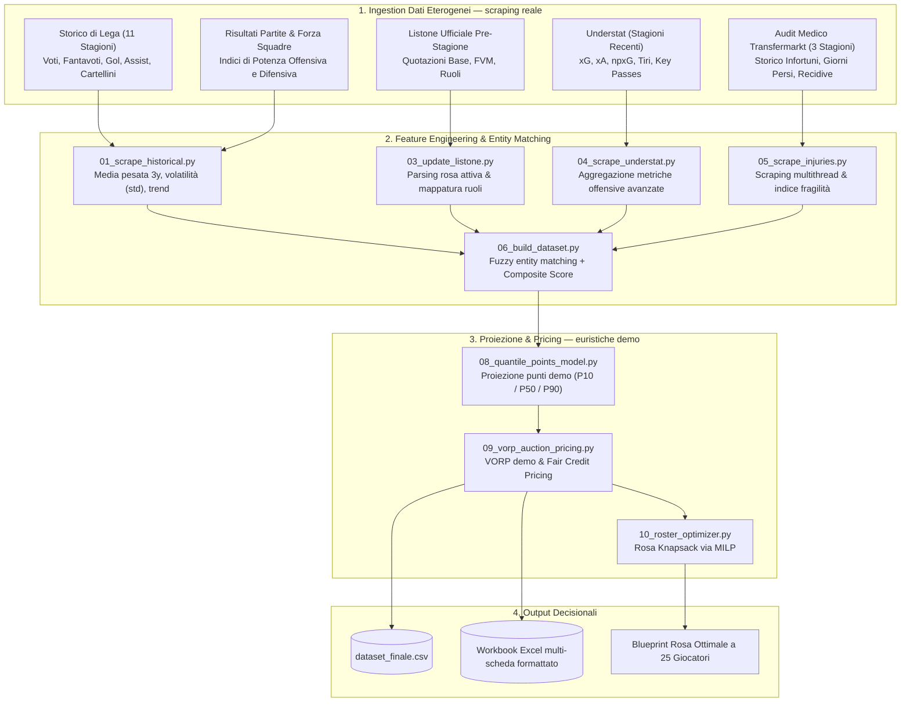
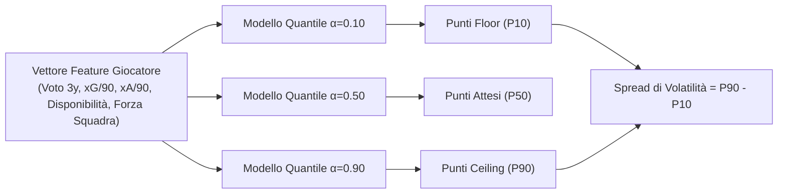
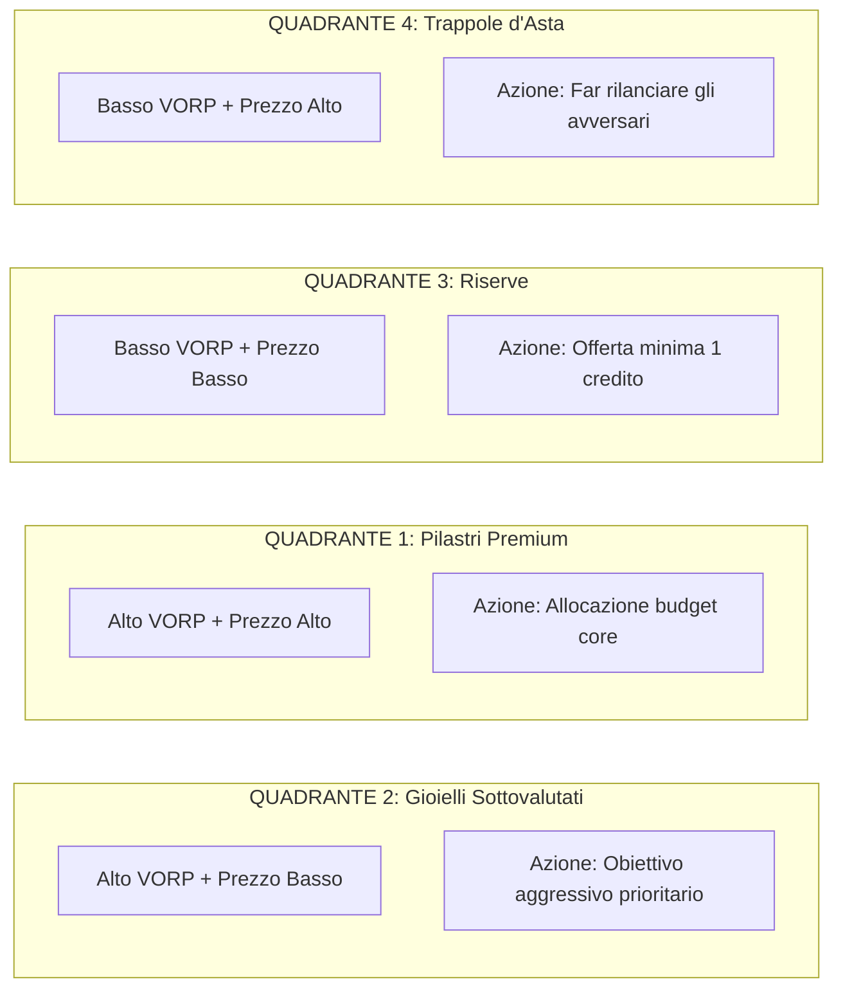

# Spectre - FantaMoneyball — Framework Quantitativo di Analisi per Fantacalcio & Lega

🇬🇧 [Read in English](README.en.md)

[](https://www.python.org/)
[](LICENSE)
[](https://docs.scipy.org/doc/scipy/reference/generated/scipy.optimize.milp.html)
[-yellow.svg)](docs/MODEL_INTERPRETABILITY.md)
[](https://buymeacoffee.com/blueskies360)

Una pipeline modulare e data-driven per l'estrazione dati, la proiezione probabilistica dei
punteggi, la valutazione sabermetrica (VORP) e l'ottimizzazione matematica della rosa per
le aste del Fantacalcio Serie A.

📖 **Guida all'interpretabilità del modello**: [docs/MODEL_INTERPRETABILITY.md](docs/MODEL_INTERPRETABILITY.md)
📐 **Metodologia del Composite Score**: [docs/scoring_methodology.md](docs/scoring_methodology.md)
🗺️ **Architettura della pipeline**: [docs/pipeline_architecture.md](docs/pipeline_architecture.md)

## Posizionamento: versione demo

**Questa è una build dimostrativa pubblica, non il sistema di produzione.** Il livello di
ingestion (`01_scrape_historical.py`, `04_scrape_understat.py`, `04b_scrape_lineups.py`,
`05_scrape_injuries.py`) fa scraping reale su fantacalcio.it, football-data.co.uk, Understat
e Transfermarkt — colpisce endpoint veri e produce dataset storici e infortuni reali. Le
formule di proiezione punti e pricing mostrate di seguito (`08_quantile_points_model.py`,
`09_vorp_auction_pricing.py`) sono dimostrative, calibrate per insegnare la metodologia, non
per vincere la tua lega. La versione di produzione — modelli reali di quantile regression
allenati su 11+ stagioni, pricing VORP raffinato, un audit engine post-asta, un trade
analyzer, un lineup optimizer e un copilot AI per il draft — è un prodotto commerciale
privato e **non** è distribuita in questo repository. Nessun link a demo live, di proposito:
clonalo, eseguilo in locale, e giudica la metodologia con le tue mani.

---

## Il Problema: Perché l'Istinto Fallisce Sistematicamente all'Asta

Ad ogni pre-stagione, milioni di fantallenatori si siedono al tavolo dell'asta convinti che
il proprio "istinto" li porterà allo scudetto. I risultati empirici sono imbarazzantemente
prevedibili:
- Il quaranta percento del budget totale viene bruciato su un attaccante la cui principale
  qualifica era una tripletta segnata contro una squadretta di paese in un'amichevole di
  luglio.
- Un difensore viene comprato a prezzo pieno, salvo poi scoprire ad ottobre che il giocatore
  passa sei mesi l'anno in riabilitazione clinica per lesioni muscolari croniche.
- Scoppia una guerra di rilanci impulsiva su un "centrocampista offensivo" i cui Expected
  Goals ogni 90 minuti sono inferiori a quelli del portiere avversario.

`Spectre - FantaMoneyball` nasce per sostituire le allucinazioni emotive con un'analisi
fredda, riproducibile e basata sui dati. Il framework non si cura dei nomi, dell'hype di
mercato o delle narrazioni mediatiche. Il suo unico scopo è quantificare il **valore atteso
corretto per il rischio** di ogni giocatore attivo e risolvere il **problema di ottimizzazione
della rosa (knapsack)**.

---

## Scopo Centrale: Moduli Analitici e Obiettivi

1. **Motore di Proiezione Probabilistica**: sostituisce le proiezioni puntuali statiche con
   intervalli di probabilità completi (P10 Pessimistico, P50 Atteso, P90 Ottimistico) per
   identificare asset boom-or-bust rispetto a titolari ad alto floor.
2. **Value Over Replacement (VORP) in stile sabermetrico**: traduce i punti fantacalcio
   proiettati in offerte in crediti eque e vincolate al budget.
3. **Ottimizzazione Matematica della Rosa a 25 Giocatori**: risolve il problema di
   programmazione lineare intera (MILP) per costruire la rosa a punti attesi massimi dato
   un budget.
4. **Scudo Anti-Hype (Pricing Corretto per il Rischio)**: penalizza sistematicamente gli
   asset cronicamente infortunati sulla base dello storico medico triennale.

---

## Demo Interattiva e Case Study (Zero-Config, output reale)

Non serve scaricare alcun dato per vedere il framework in azione. Esegui la demo interattiva
standalone con un solo comando:

```bash
python demo.py
```

Questo è l'output testuale reale ottenuto sul dataset di esempio incluso
(`examples/dataset_sample.csv`) — riproducibile da chiunque cloni il repository, nessun
numero scelto ad arte:

### Demo 1 — Trappola Mediatica vs Gioiello Statistico (Inefficienza di Mercato)

| Attributo | Gioiello Sottovalutato — Calhanoglu (C, INT) | Trappola Sopravvalutata — Yildiz (A, JUV) |
|---|---|---|
| Prezzo di listino ufficiale | 28 crediti | 22 crediti |
| Prezzo equo razionale (VORP) | 243 crediti (VORP: 40.6 pt) | 80 crediti (VORP: 61.4 pt) |
| Valore di mercato residuo | +152 crediti (grande affare) | -201 crediti (brucia-budget) |
| Punti stagionali attesi (P50) | 207.1 pt (Floor: 128.0 / Ceiling: 253.8) | 193.8 pt (Floor: 101.1 / Ceiling: 258.3) |
| Giorni di infortunio (3y) | 216 giorni (Malus: 0.700) | 37 giorni (Malus: 0.144) |
| Azione consigliata all'asta | Obiettivo primario | Da evitare / far rilanciare gli avversari |

### Demo 2 — Incertezza Quantile (Boom-or-Bust vs Floor Solido)

Le medie statiche nascondono la volatilità. Due giocatori possono proiettare punteggi simili
in media, pur avendo profili di rischio opposti:

- **Profilo Boom-or-Bust — Dovbyk (A, BOL)**: Floor (P10) 48.0 pt / Atteso (P50) 150.4 pt /
  Ceiling (P90) 240.5 pt — spread di 192.5 pt, obiettivo ad alto potenziale.
- **Profilo Floor Solido — Dimarco (D, INT)**: Floor (P10) 163.6 pt / Atteso (P50) 226.4 pt /
  Ceiling (P90) 253.9 pt — spread di 90.3 pt, titolare sicuro ogni settimana.

### Demo 3 — Solver MILP Istantaneo per Rosa da 25 Giocatori

```
[SOLVER RESULT] Rosa ottimale trovata in <0.05 secondi:
  Budget = 500 Crediti | 3 Portieri | 8 Difensori | 8 Centrocampisti | 6 Attaccanti
  Spesa totale: 415 / 500 crediti (Rimanenza: 85 cr)
  Punti stagionali proiettati: 5019.9 pt (Floor: 2665.5 | Ceiling: 6053.3)

  Asset chiave selezionati dal solver MILP:
  [Portiere       ] Mascardi           (TOR) Costo: 1cr | Att:178.6 pt | VORP: 33.4
  [Top Difensore  ] Dimarco            (INT) Costo:31cr | Att:226.4 pt | VORP: 64.5
  [Top Centrocamp.] Paz N.             (COM) Costo:29cr | Att:218.3 pt | VORP: 51.8
  [Top Attaccante ] Malen              (ROM) Costo:38cr | Att:217.6 pt | VORP: 85.2
```

---

## Architettura della Pipeline di Elaborazione Dati & ML



---

## Come funziona il modello predittivo

Spectre - FantaMoneyball usa un modello statistico per stimare un range di punteggio atteso
(pessimistico / medio / ottimistico) per ogni giocatore, tenendo conto di infortuni e forma
recente. Il prezzo equo ("fair price") nasce confrontando il valore atteso di ogni giocatore
con il resto del mercato.

Il motore predittivo vero e proprio è un pacchetto separato e proprietario
(`fanta_lab_engine`). Senza di esso, l'app funziona comunque con valori dimostrativi tratti
da `examples/dataset_sample.csv` — utile per esplorare l'interfaccia e la metodologia, non
per un uso in lega reale.

---

## Moduli di Machine Learning & Ottimizzazione (metodologia, calibrazione demo)

### 1. Quantile Regression Probabilistica (`08_quantile_points_model.py`)

Le proiezioni statiche falliscono perché nascondono il rischio. Un attaccante volatile e un
difensore stabile potrebbero entrambi proiettare 200 punti, ma i loro profili di rischio sono
completamente diversi. La metodologia allena tre regressori quantile distinti:
- **Floor P10 ($\alpha=0.10$)**: proiezione conservativa dello scenario peggiore.
- **Mediana P50 ($\alpha=0.50$)**: esito totale punti più probabile.
- **Ceiling P90 ($\alpha=0.90$)**: scenario di massimo potenziale (breakout).
- **Spread di Volatilità ($\text{P90} - \text{P10}$)**: quantifica l'incertezza boom-or-bust.



Lo schema completo dei pesi e la formula del malus infortuni usati in questa build demo sono
documentati in [docs/scoring_methodology.md](docs/scoring_methodology.md) — questa è la
calibrazione *demo*, non quella usata nel prodotto commerciale.

### 2. VORP Sabermetrico & Fair Credit Pricing (`09_vorp_auction_pricing.py`)

Il valore d'asta di un giocatore non sono i suoi punti grezzi, ma i punti che produce
**al di sopra del miglior giocatore liberamente disponibile nel suo ruolo (Replacement
Level)**.

1. **Baseline di Rimpiazzo per Ruolo**: i punti proiettati dell'$(N_{\text{Titolari}} + 1)$-esimo
   giocatore per ogni ruolo.
2. **Value Over Replacement Player (VORP)**:
   $$\text{VORP}_i = \max\left(0, \text{PuntiAttesi}_i - \text{Baseline}_{\text{Ruolo}(i)}\right)$$
3. **Allocazione del Valore Equo d'Asta**:
   $$\text{PrezzoEquo}_i = 1 + \left(\text{Budget Totale Lega} - \text{Riserva}\right) \times \frac{\text{VORP}_i}{\sum_{j} \text{VORP}_j}$$
4. **Valore di Mercato Residuo**:
   $$\text{ValoreResiduo} = \text{PrezzoEquo} - \text{PrezzoUfficialeMercato}$$

### 3. Ottimizzatore Matematico della Rosa a 25 Giocatori (`10_roster_optimizer.py`)

La costruzione della rosa è formulata come problema di **Programmazione Lineare Intera Mista
(MILP)**, risolto tramite `scipy.optimize.milp`:

$$\max \sum_{i=1}^{N} \text{PuntiAttesi}_i \cdot x_i$$

Soggetto a vincoli rigidi di ruolo e budget:
$$\sum_{i=1}^{N} \text{Prezzo}_i \cdot x_i \le \text{Budget} \quad (\text{es. 500 o 1.000 crediti})$$
$$\sum_{i \in \text{Portieri}} x_i = 3, \quad \sum_{i \in \text{Difensori}} x_i = 8, \quad \sum_{i \in \text{Centrocampisti}} x_i = 8, \quad \sum_{i \in \text{Attaccanti}} x_i = 6$$
$$x_i \in \{0, 1\}$$

---

## Matrice Decisionale Pre-Asta (Valore vs Prezzo)

Incrociando il **Punteggio Finale** e il **VORP** con il **Prezzo di Mercato**, ogni
giocatore viene segmentato in quattro quadranti operativi:

| Fascia di Punteggio | Prezzo di Mercato Basso / Budget | Prezzo di Mercato Alto / Premium |
|---|---|---|
| **Alto Punteggio Finale & VORP**<br/>*(rendimento elite & affidabilità)* | **QUADRANTE 2 — GIOIELLI SOTTOVALUTATI (Obiettivi Primari)**<br/>Giocatori con numeri sottostanti elite, alta disponibilità e xG solido, sottovalutati dal prezzo di mercato standard. È qui che si vincono le leghe. | **QUADRANTE 1 — PILASTRI PREMIUM LEGITTIMI**<br/>Giocatori top-tier certificati con metriche dominanti e affidabilità fisica. Un'allocazione di budget significativa è matematicamente giustificata. |
| **Basso Punteggio Finale & VORP**<br/>*(metriche mediocri o alta fragilità)* | **QUADRANTE 3 — RISERVE (Offerta Minima)**<br/>Titolari di livello inferiore o riserve da assicurarsi al prezzo base minimo (1 credito) per completare la rosa senza bruciare capitale. | **QUADRANTE 4 — TRAPPOLE D'ASTA (Asset Sopravvalutati)**<br/>Giocatori di grande nome reduci da infortuni catastrofici o in declino tattico. Obiettivo primario: far salire il prezzo e lasciare che i concorrenti brucino il budget. |



---

## Struttura del Repository

```
fantaofficina/
├── core/config.py                      # Configurazione globale, pesi scoring, mapping squadre
├── run_pipeline.py                     # Entry point CLI unificato con parser di step
├── demo.py                             # Demo interattiva da terminale, zero-config
├── requirements.txt                    # Dipendenze Python (pandas, scikit-learn, scipy, flask)
├── LICENSE                             # Licenza PolyForm Noncommercial 1.0.0
├── core/ingestion/static/
│   ├── 01_scrape_historical.py         # Stage 1: scraping storico multi-stagione (reale)
│   ├── 03_update_listone.py            # Stage 2: ingestion listone ufficiale
│   ├── 04_scrape_understat.py          # Stage 2b: scraping xG/xA sottostanti (reale)
│   ├── 04b_scrape_lineups.py           # Stage 2c: scraping formazioni (reale)
│   ├── 05_scrape_injuries.py           # Stage 3: scraper infortuni Transfermarkt (reale)
│   ├── 06_build_dataset.py             # Stage 4: entity resolution fuzzy & Composite Score
│   ├── 08_quantile_points_model.py     # Stage 5: proiezione punti demo (P10/P50/P90)
│   ├── 09_vorp_auction_pricing.py      # Stage 6: VORP demo & Fair Credit Pricing
│   ├── 10_roster_optimizer.py          # Stage 7: ottimizzatore rosa MILP
│   └── 07_generate_excel.py            # Stage 8: generatore foglio Excel multi-scheda
├── web/app.py                          # Interfaccia web locale (workflow base d'asta)
├── docs/
│   ├── pipeline_architecture.md        # Documentazione approfondita del flusso dati
│   ├── scoring_methodology.md          # Formule matematiche demo e pesi delle feature
│   └── data_sources.md                 # Specifiche API di ingestion e fallback
├── examples/
│   └── dataset_sample.csv              # Dataset di esempio pronto all'uso (no scraping)
└── data/                                # Directory di lavoro (artefatti generati)
```

Timeline:
- [Timeline del progetto](docs/it/TIMELINE_PROGETTO.md)
- [Project timeline](docs/en/PROJECT_TIMELINE.md)

---

## Guida Rapida (Quick Start)

### 1. Setup dell'ambiente
```bash
git clone https://github.com/spectrelabo/fantaofficina.git
cd fantaofficina

python3 -m venv venv
source venv/bin/activate

pip install -r requirements.txt
```

### 2. Esecuzione della pipeline

```bash
# Esegui la pipeline completa end-to-end (Scraping -> Scoring -> ML Demo -> VORP -> Optimizer -> Excel)
python run_pipeline.py

# Esegui singoli step
python run_pipeline.py --step 8    # Proiezioni quantile demo (P10/P50/P90)
python run_pipeline.py --step 9    # Calcolo VORP demo & Fair Credit Pricing
python run_pipeline.py --step 10   # Solver MILP rosa a 25 giocatori
python run_pipeline.py --step 7    # Esporta il foglio Excel multi-scheda

# Esegui da uno step specifico in poi
python run_pipeline.py --from 8
```

### 3. Avvia l'interfaccia web locale

```bash
python web/app.py
```

---

## Artefatti Generati

1. **`data/analisi_fantacalcio_completa.xlsx`**: workbook Excel multi-scheda con fogli per
   ruolo (Portieri, Difensori, Centrocampisti, Attaccanti), punti attesi demo, pricing VORP
   e legenda della strategia d'asta.
2. **`data/dataset_finale.csv`**: dataset master per analisi programmatiche a valle.
3. **`data/storico_infortuni.csv`**: report di audit clinico e fragilità fisica triennale
   per tutti i giocatori tracciati.
4. **`examples/dataset_sample.csv`**: dataset di esempio rappresentativo con metriche demo
   complete per validazione istantanea senza scraping.

---

## Crediti & Fonti di Ingestion

Questo progetto poggia sulle spalle della comunità open-source di analytics calcistiche:

- **[fantabeto](https://github.com/uPeppe/fantabeto)** di [@uPeppe](https://github.com/uPeppe): lavoro pionieristico nell'applicazione di modelli neurali bayesiani alla stima delle performance nel fantacalcio.
- **[Fantacalcio.it](http://fantacalcio.it/)**: voti ufficiali, dati storici delle partite, anagrafica giocatori e quotazioni.
- **[FBref.com](http://fbref.com/)**: repository di riferimento per le statistiche del calcio europeo.
- **[ff_prob](https://github.com/amiles2233/ff_prob)**: ispirazione fondativa per l'applicazione di modelli probabilistici alle proiezioni fantasy.
- **[Scrape-FBref-data](https://github.com/parth1902/Scrape-FBref-data)**: utility per l'estrazione strutturata dei dati.
- **[Understat.com](https://understat.com/)**: analytics a livello di tiro, Expected Goals ($xG$) ed Expected Assists ($xA$).
- **[Transfermarkt.com](https://www.transfermarkt.com/)**: storico infortuni completo, partite saltate e anamnesi mediche.

---

## Sostieni il Progetto

Se `Spectre - FantaMoneyball` ti ha evitato un rilancio emotivo alle 2 di notte, ti ha
salvato il budget, o ti ha dato un vantaggio algoritmico nella tua asta fantacalcistica,
considera di offrire un caffè per sostenere la manutenzione open-source in corso:

[](https://buymeacoffee.com/blueskies360)

---

## Contribuire & Licenza

Contributi, proposte di feature ed estensioni del modello sono benvenuti tramite Pull
Request e Issue. Distribuito sotto **licenza PolyForm Noncommercial 1.0.0**. L'uso non
commerciale, di ricerca e personale è liberamente consentito; l'uso commerciale richiede una
licenza separata dal detentore del copyright. Vedi [LICENSE](LICENSE) per il testo legale
completo.

Mantenuto da [SpectreLabo](https://github.com/spectrelabo).
