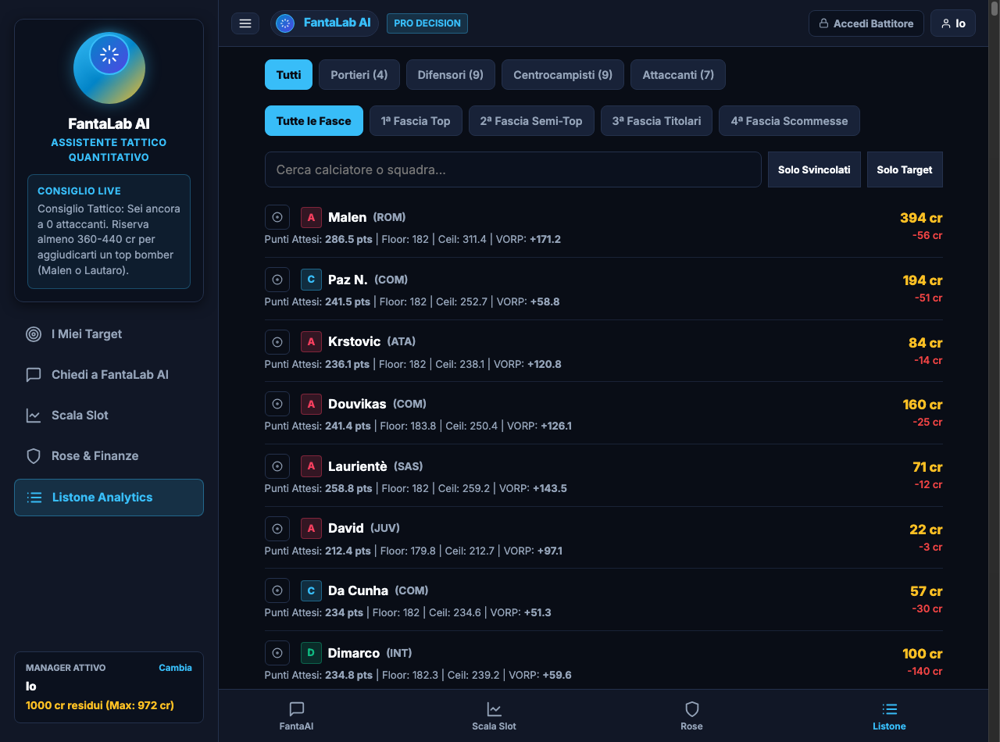

# core.ingestion

## 1. Divulgativo
Questo modulo è la fabbrica dei dati. Da una parte raccoglie e pulisce tutto quello che serve prima dell’asta — storico voti, quotazioni, xG/xA, infortuni, modelli previsivi e prezzi fair — dall’altra costruisce il feed dinamico della giornata con titolarità, quote, risultati e status. È qui che il progetto passa dal web scraping grezzo a un flusso strutturato che produce file utilizzabili dal solver, dall’audit e dalla web app.

## 2. Tecnico
La parte `core/ingestion/static/` esegue la pipeline pre-asta; la parte `core/ingestion/dynamic/` produce `data/current_matchday.json` per i moduli live.

### Static pipeline (`core/ingestion/static/`)

1. `01_scrape_historical.py` — scarica 11 stagioni da fantacalcio.it e football-data.co.uk, poi aggrega storico giocatori e indici squadra.
2. `03_update_listone.py` — legge il workbook Quotazioni ufficiali, esclude i ceduti e costruisce il listone base attivo in memoria.
3. `04_scrape_understat.py` — interroga l’API interna di Understat e aggrega xG, xA, npxG e shot volume per giocatore.
4. `04b_scrape_lineups.py` — estrae le formazioni reali iniziali da Sofascore per stimare `starts_2627`, minuti e flag `is_starter_2627`.
5. `05_scrape_injuries.py` — fa scraping multithread su Transfermarkt, costruisce cache clinica 3y e calcola il malus fragilità.
6. `06_build_dataset.py` — fonde listone, storico, Understat, indici squadra, infortuni e lineup data; genera `dataset_finale.csv` e `storico_infortuni.csv`.
7. `07_generate_excel.py` — esporta il dataset in workbook Excel multi-sheet con colonne analitiche e legenda.
8. `08_quantile_points_model.py` — addestra 3 GradientBoostingRegressor quantilici e scrive `predicted_pts_p10`, `predicted_pts_p50`, `predicted_pts_p90`.
9. `09_vorp_auction_pricing.py` — calcola replacement baselines, `vorp_points`, fair prices 500/1000 e `surplus_value_cr`.
10. `10_roster_optimizer.py` — risolve un MILP knapsack per costruire la rosa teoricamente ottima sotto vincoli di budget e ruoli.

Utility statiche collegate:
- `target_pricing.py` — econometric target/clearing pricing engine con RoleFade, market anchors e bargain detection.
- `generate_excel_italiano.py` — export Excel in italiano per lega e amici.

### Dynamic pipeline (`core/ingestion/dynamic/`)
- `scrape_lineups.py` — recupera projected lineups e availability context dei match della giornata.
- `scrape_odds.py` — raccoglie quote e implied probabilities, poi le rende utilizzabili per il calcolo xPts.
- `scrape_results.py` — acquisisce risultati e dati di output delle partite concluse.
- `scrape_status.py` — traccia status come OK / INFORTUNATO / SQUALIFICATO per overlay live.
- `build_feed.py` — unisce gli scraper dinamici e genera il feed finale `data/current_matchday.json`.
- `client.py` — carica il feed con fallback safe per i consumer applicativi.
- `utils.py` — helper condivisi, inclusa normalizzazione nomi per chiavi coerenti.
- `api_football_client.py` — adapter HTTP verso la sorgente match-data esterna.

Il data flow riprende la spec di `docs/pipeline_architecture.md`, ma con i path aggiornati a `core/ingestion/static/` e `core/ingestion/dynamic/`. Le sorgenti documentate in `docs/data_sources.md` restano quattro: fantacalcio.it, Understat, Transfermarkt e football-data.co.uk. La parte statica costruisce artefatti batch; la parte dinamica fa overlay settimanale che viene letto da `modules/common/data_provider.py` e dalla UI.

## 3. Screenshot

## 4. Dipendenze
- Dipende da `core/config.py` per path, headers, mappings e costanti.
- `static/` dipende da file in `data/` e da sorgenti esterne documentate in `docs/data_sources.md`.
- `dynamic/` produce `data/current_matchday.json`, poi letto da `core.ingestion.dynamic.client`, `modules/common/data_provider.py`, `modules/lineup/lineup_solver.py`, `modules/trades/trade_analyzer.py` e `web/app.py`.
