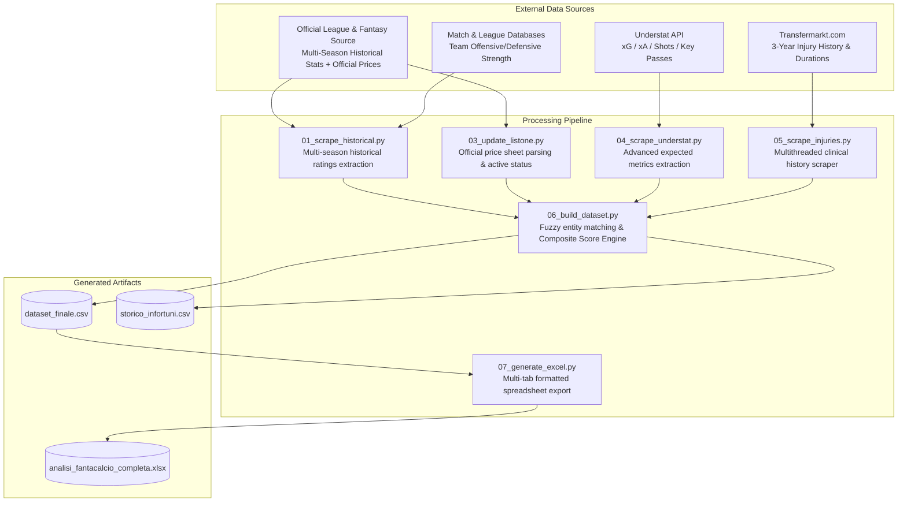

# Pipeline Architecture — Spectre - FantaMoneyball

`Spectre - FantaMoneyball` is a modular, multi-source framework for extracting, aggregating, and modeling football player performance data to optimize pre-season fantasy auction strategies.

---

## Data Flow Architecture



---

## Pipeline Execution Stages

### Stage 1: Historical Data Ingestion (pipeline/01_scrape_historical.py)
- **Objective**: Collect detailed player statistics across multiple historical seasons.
- **Outputs**:
  - `data/storico_giocatori_raw.csv`: Raw match/season records (~5,000 player-season rows).
  - `data/storico_giocatori_aggregato.csv`: Decaying weighted ratings (3y with 3-2-1 weighting), performance volatility (standard deviation), multi-year trend slopes, availability rates, and per-appearance bonus/penalty metrics.
  - `data/storico_squadre_aggregato.csv`: Team-level offensive and defensive rating coefficients.

### Stage 2: Price Sheet Ingestion (pipeline/03_update_listone.py)
- **Objective**: Parse the official pre-season fantasy quotations workbook, separate active players from transferred/departed assets, and establish baseline roster profiles.
- **Outputs**: In-memory active player structure with role mapping (Classic & Mantra positional roles), base pricing, and market valuations.

### Stage 2b: Advanced Offensive Metrics (pipeline/04_scrape_understat.py)
- **Objective**: Query the Understat API to extract Expected Goals (xG), Expected Assists (xA), non-penalty xG (npxG), and shot-creation volume per 90 minutes.
- **Outputs**:
  - `data/understat_raw.csv`
  - `data/understat_aggregato.csv` (3y weighted averages and per-90 metrics).

### Stage 3: Injury & Fragility Audit (pipeline/05_scrape_injuries.py)
- **Objective**: Execute multithreaded asynchronous scraping on Transfermarkt for every active player, cross-referencing player name and club affiliation.
- **Outputs**:
  - `data/tm_injuries_cache.json` (persistent local cache).
  - Metrics: total days injured, total absence events, severe injury indicator (>= 60 days), and medical fragility index.

### Stage 4: Entity Resolution & Dataset Synthesis (pipeline/06_build_dataset.py)
- **Objective**: Perform multi-source fuzzy matching across disparate naming conventions (handling diacritics, nicknames, initializations, and manual homonym overrides) and compute the risk-adjusted Composite Score.
- **Outputs**:
  - `data/dataset_finale.csv` (unified 37-column analytics matrix).
  - `data/storico_infortuni.csv` (detailed physical fragility audit).

### Stage 5: Formatted Multi-Sheet Workbook Generation (pipeline/07_generate_excel.py)
- **Objective**: Generate a formatted Excel spreadsheet featuring positional tabs, conditional color coding, and an auction strategy guide.
- **Outputs**:
  - `data/analisi_fantacalcio_completa.xlsx` (Sheets: Full List, Goalkeepers, Defenders, Midfielders, Forwards, Legend).

---

## CLI Execution

```bash
# Execute entire pipeline end-to-end
python run_pipeline.py

# Execute specific individual stages
python run_pipeline.py --step 6
python run_pipeline.py --step 7

# Execute from a specific starting step onward
python run_pipeline.py --from 4
```
