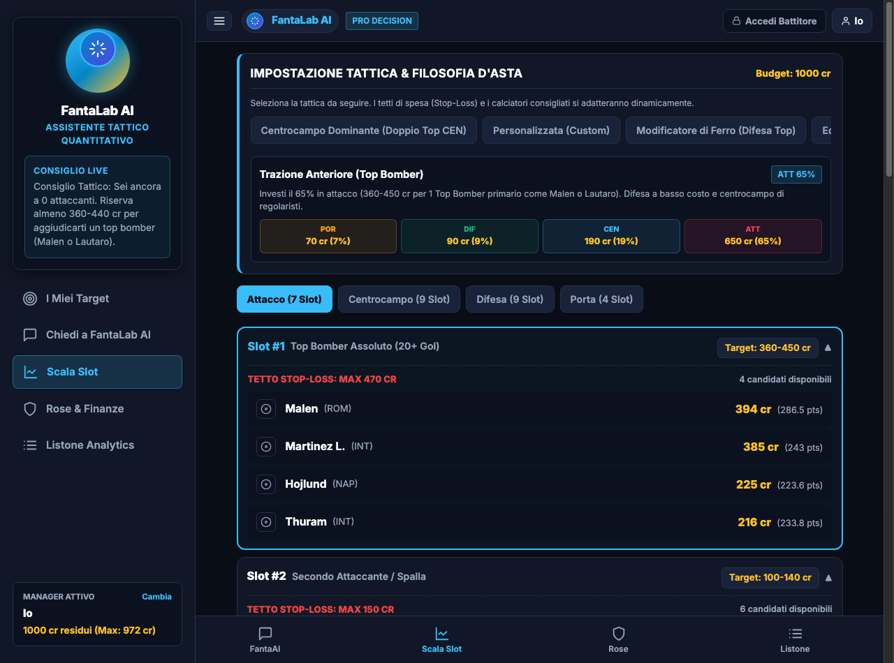

# modules.auction

La logica d'asta (VORP, Knapsack MILP, Stop-Loss, Live Draft, blueprint tattici, assegnazione battitore) vive attualmente in `web/app.py` e non in questo modulo.

## 1. Divulgativo
Questa cartella esiste per documentare la logica dell’asta anche se oggi il codice è ancora dentro la web app. Qui trovi il riassunto delle regole che guidano blueprint, cap per reparto, fasce slot e limiti di spesa emotiva durante il draft live. In pratica è il manuale della parte asta, non ancora il suo package eseguibile.

## 2. Tecnico
In `web/app.py` la logica d’asta ruota attorno a `TACTICAL_PRESETS`, `get_dynamic_fair_prices()`, `compute_market_inflation()` e agli endpoint di assegnazione live.

Blueprint richiesti dal redesign documentale:
- **Trazione Anteriore** — `P 5% / D 15% / C 25% / A 55%`
- **Modificatore di Ferro** — `P 8% / D 32% / C 25% / A 35%`
- **Centrocampo Dominante** — `P 6% / D 18% / C 42% / A 34%`
- **Moneyball** — `P 7% / D 23% / C 30% / A 40%`

La formula concettuale del cap per reparto è:

$$Cap_{Ruolo} = Budget_{Lega} \times Quota_{Ruolo}$$

Nel codice la quota effettiva viene applicata tramite `budget_shares` e `split_pct`, poi trasformata in prezzi fair dinamici e slot ladders.

`get_dynamic_fair_prices()` ricalibra i prezzi su budget, numero squadre e roster slots personalizzati. Per ogni ruolo calcola replacement baseline, VORP e fair price role-aware con esponente di scarsità.

La Scala Slot Tiers usata dalla UI classifica i giocatori per ruolo `P/D/C/A` in 4 fasce disgiunte:
- **Tier 1** — top 10%
- **Tier 2** — percentili 10-30%
- **Tier 3** — percentili 30-65%
- **Tier 4** — resto del ruolo

Questa logica vive di fatto tra caricamento dataset, pricing dinamico e preset tattici dell'asta live.

## 3. Screenshot

## 4. Dipendenze
- La documentazione punta a `web/app.py` come sede attuale del codice.
- Concettualmente dipende anche dalle colonne prodotte da `core/ingestion/static/08_quantile_points_model.py` e `09_vorp_auction_pricing.py`.
- La UI d’asta usa inoltre stato condiviso (`auction_state.json` / Redis), dataset e configurazione di lega.
